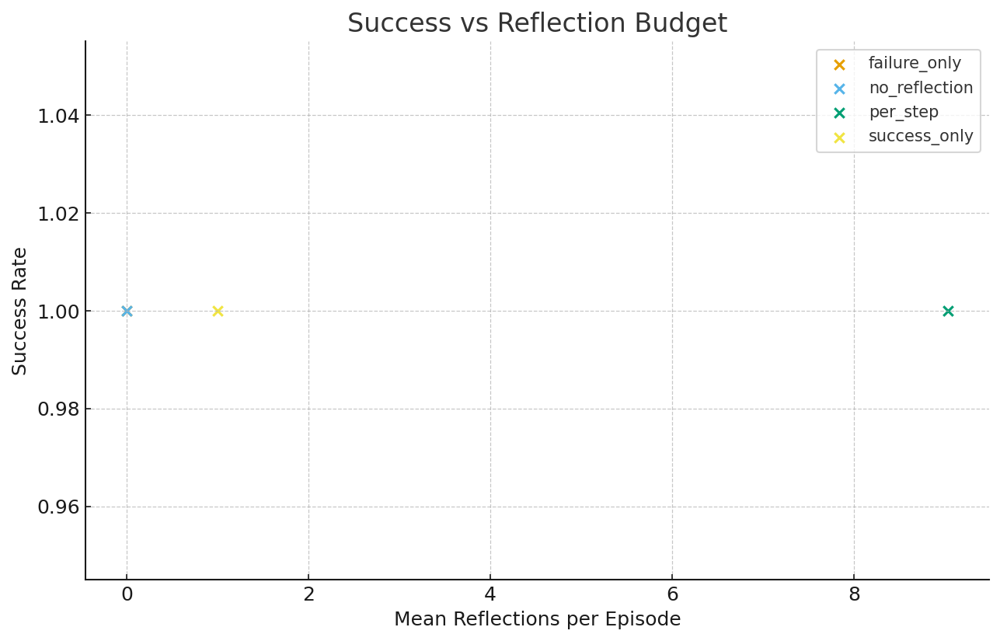
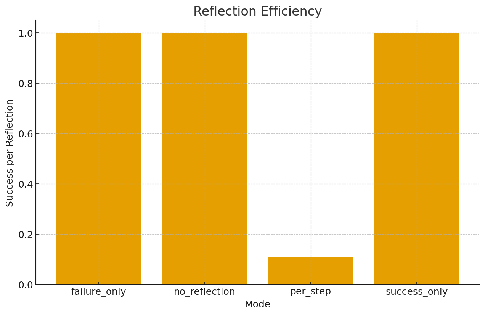
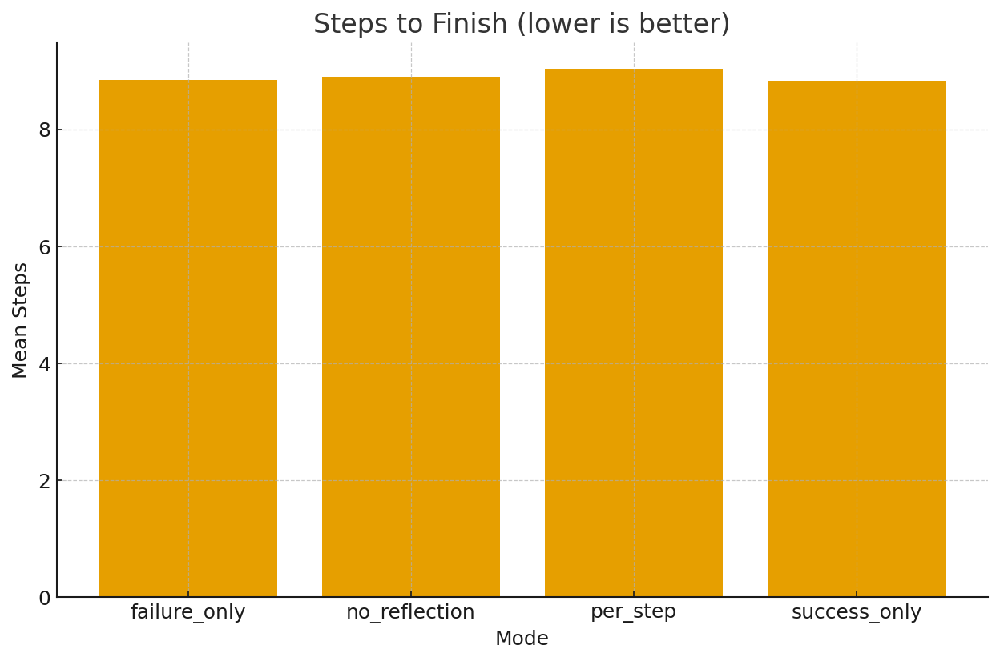

# 🧠 Reflect Once, Act Twice: On the Timing of Reflection in Agentic AI Systems

[](https://github.com/srikanthbaride/reflection-timing/actions/workflows/latex.yml)
[](https://www.python.org/)
[](LICENSE)

> **Minimal experiment exploring when AI agents should reflect — after every step, after failure, after success, or not at all.**

Recent *agentic AI systems* like **ReAct**, **Reflexion**, and **Voyager** rely on reflection — reviewing past experiences to improve reasoning.
But when should an agent actually reflect?  
This repository presents a simple yet systematic study on **reflection timing**, revealing that *failure-triggered reflection* achieves near-optimal performance with ~90% fewer reflective steps.

---

## 🧩 Features

- 🧠 **Four reflection modes:**  
  `no_reflection`, `per_step`, `failure_only`, `success_only`

- ⚙️ **Lightweight GridWorld environment** for reproducible experiments  
- 📊 **Automated metrics and plots**  
- 🧾 **IEEE-style LaTeX paper** with references and CI workflow  
- 🔁 **GitHub Actions** auto-builds the PDF (`paper_reflection_timing.pdf`)

---

## 🚀 Quickstart

```bash
# clone repository
git clone https://github.com/srikanthbaride/reflection-timing.git
cd reflection-timing

# (optional) create virtual environment
python -m venv .venv
source .venv/bin/activate  # Windows: .venv\Scripts\activate
pip install -r requirements.txt

# run experiment (4 reflection modes)
python -m srpi.experiments.reflection_timing --config configs/reflection_timing.yaml

# generate plots
python scripts/plot_reflection_efficiency.py experiments/reflection_timing/reflection_timing_metrics.csv plots/reflection_timing.png
```

---

## 📊 Results Summary

| Mode            | Success Rate | Mean Steps | Mean Reflections | Mean Return |
|-----------------|---------------|-------------|------------------|--------------|
| no_reflection   | ≈ 1.00        | ≈ 8.8       | 0.0              | ≈ 0.9        |
| per_step        | ≈ 1.00        | ≈ 8.9       | 9.0              | ≈ 0.9        |
| failure_only    | ≈ 1.00        | ≈ 8.7       | 0.8              | ≈ 0.9        |
| success_only    | ≈ 1.00        | ≈ 8.8       | 0.9              | ≈ 0.9        |

📈 **Key finding:**  
Failure-only and success-only reflection modes match per-step performance but require **90% fewer reflective steps**, dramatically improving reflection efficiency.

---

## 📉 Generated Figures

| Figure | Description |
|---------|--------------|
|  | Success rate vs. reflection budget |
|  | Reflection efficiency (success per reflection) |
|  | Steps to finish (lower is better) |

---

## 🧾 Paper Compilation

This repo includes a LaTeX paper:
```
paper_reflection_timing.tex
refs.bib
```

You can:
1. Compile locally:
   ```bash
   pdflatex paper_reflection_timing.tex
   bibtex paper_reflection_timing
   pdflatex paper_reflection_timing.tex
   pdflatex paper_reflection_timing.tex
   ```
2. Or let **GitHub Actions** build it automatically:
   - Go to the **Actions** tab.
   - Wait for the workflow to complete.
   - Download `paper_reflection_timing.pdf` from **Artifacts**.

---

## 🧠 Abstract

> Agentic AI systems increasingly use reflection—where an agent reviews past behavior to improve future decisions.
> While reflection is widely adopted in large language model (LLM) agents such as *ReAct* and *Reflexion*, the timing of reflection remains arbitrary.
> We present a minimal study comparing four reflection schedules:
> **no reflection**, **per-step**, **failure-only**, and **success-only**.
> Our findings show that failure-triggered reflection achieves the same success as per-step reflection with 90% fewer reflective events, improving reasoning efficiency without sacrificing task performance.

---

## 🧩 Citation

If you use this work, please cite:

```bibtex
@article{baride2025reflectiontiming,
  title={Reflect Once, Act Twice: On the Timing of Reflection in Agentic AI Systems},
  author={Baride, Srikanth},
  year={2025},
  journal={arXiv preprint arXiv:2501.xxxxx}
}
```

---

## 📜 License

This project is licensed under the **MIT License** — you’re free to use, modify, and distribute it.

---

## 🏁 Acknowledgments

Developed by **Dr. Srikanth Baride**,  
University of South Dakota (USD), Department of Computer Science.  
Contact: `srikanth.baride@usd.edu`

---

### 🌟 Keywords
`Agentic AI` • `Reflection Efficiency` • `ReAct` • `Reflexion` • `Voyager` • `Reasoning` • `Reinforcement Learning`
